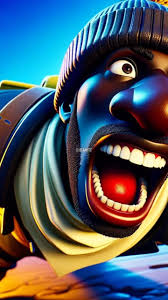

# **Fortnite**
#### |When your circle gets smaller, it means you’re winning.
#### |Don’t get carried away, even the winners are dragged back to the lobby.
#### |Gliders help you at your highest, and leave you at your lowest.
 
 
|george flowberry|martin looter ping|
|----------------|------------------|
|yes             |ok                |
> There are two main things that make Fortnite's battle royale mode a great experience: The thrill of taking down enemies and looking forward to their loot drops. The wide range of weapons and gadgets encourage players to specialize and customize their character

Fortnite!

